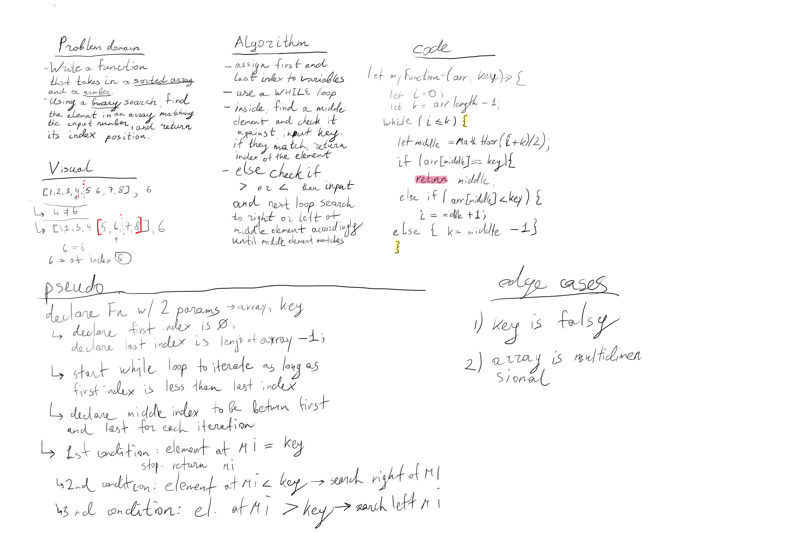

# 401-JS: Code Challenge 3 - Binary search in a sorted 1D array

Binary search in a sorted 1D array

## Whiteboard Process

## Approach & Efficiency

Took about 2 hours to draw.

## Collaborators

Mark Thanadabouth;
