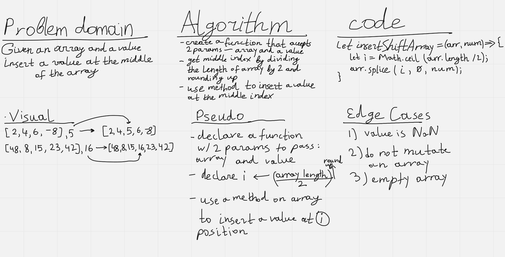

# 401-JS: Code Challenge 2 - Insert into an Array and Shift

Insert and shift an array in middle at index

## Whiteboard Process

## Approach & Efficiency

I decided to use a Array.splice() method, and find the necessary params for that method, which is an index position in the array.

It is a 4 line code.
Took about 15 minutes.
