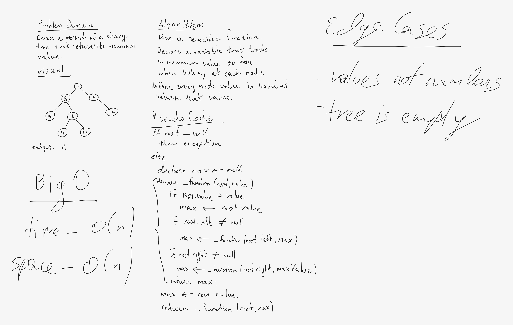

# 401-JS: Code Challenge 16 - Find Max Value in a Binary Tree

## Challenge

Write the following method for the Binary Tree class

- find maximum value
  - Arguments: none
  - Returns: number

Find the maximum value stored in the tree. You can assume that the values stored in the Binary Tree will be numeric.

## Approach & Efficiency
<!-- What approach did you take? Why? What is the Big O space/time for this approach? -->

The approach for this method is to traverse the whole tree to find the biggest value possible. So Big O time is O(n) since we have to look at evero node.

## API
<!-- Description of each method publicly available to your Trees -->
preOrder, inOrder, postOrder - traverses the binary tree in a specific order and returns and array of all values. 
findMax() - finds maximum numeric value in a regular binary tree.

<!-- ## Whiteboard -->

