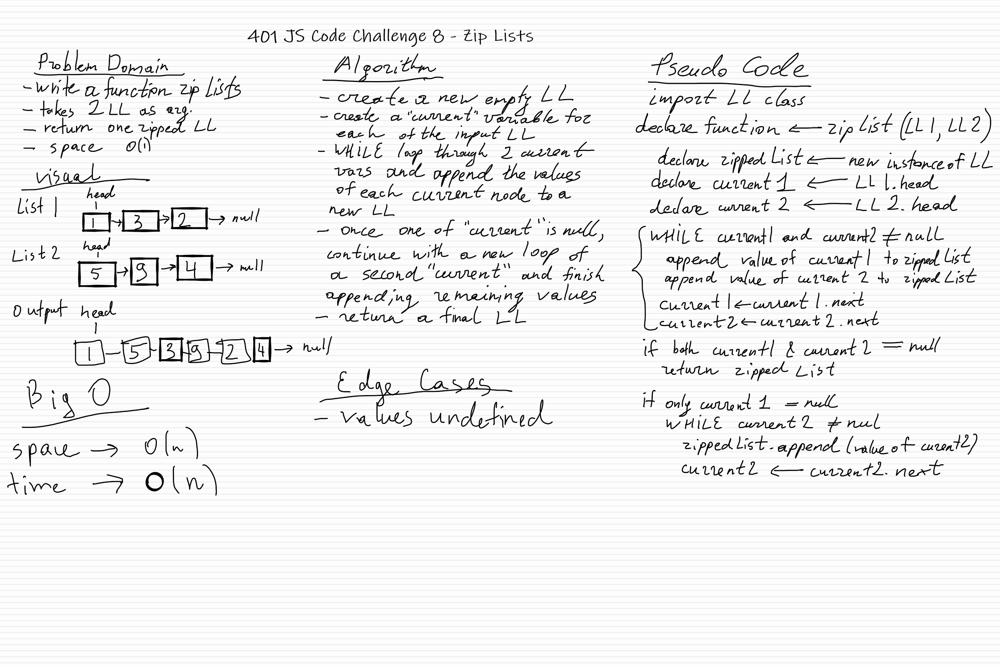

# 401-JS: Code Challenge 8 - Zip two linked lists

## Challenge

Write a function called zip lists

- Arguments: 2 linked lists
- Return: Linked List, zipped as noted below
- Zip the two linked lists together into one so that the nodes alternate between the two lists and return a - reference to the head of the zipped list.
  
## Approach & Efficiency
<!-- What approach did you take? Why? What is the Big O space/time for this approach? -->

My approach was to create a new linked list, and use `append` method of the Linked List class that I created in a previous code challenge. That way, the original linked lists are not modified. Big O for space with this approach is O(n).

## API
<!-- Description of each method publicly available to your Linked List -->

- insert(value)
  - Adds a new node with that value to the head of the list with an O(1) Time performance.
- includes(value)
  - Indicates whether that value exists as a Node’s value somewhere within the list.
- toString()
  - Returns: a string representing all the values in the Linked List, formatted as: ```"{ a } -> { b } -> { c } -> NULL"```
- append(value)
  - adds a new node with the given value to the end of the list
- insertBefore(value, newValue)
  - adds a new node with the given new value immediately before the first node that has the value specified
- insertAfter(value, newValue)
  - adds a new node with the given new value immediately after the first node that has the value specified
- kthFromEnd(k)
  - Return the node’s value that is k places from the tail of the linked list
  

## Whiteboard

