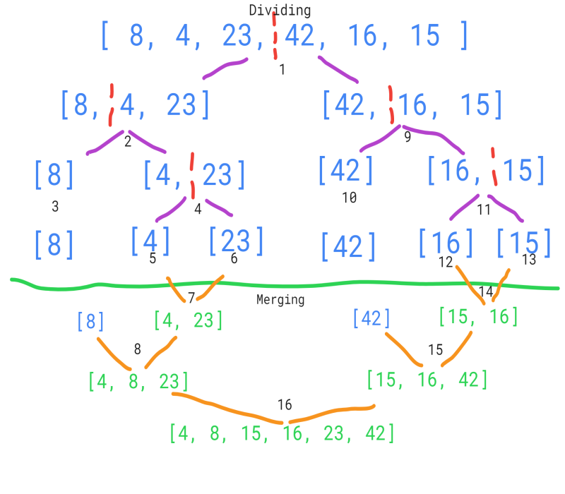

# Merge Sort

# Insertion Sort algorithm step-by-step

**Author:** Ayrat Gimranov

## Description

Merge Sort is a sorting algorithm that works by resursively dividing an array into two halves until each single element is contained within its own array, and then merging the elements by sorting them one by one.

## Algorithm Code

Here is the pseudocode of the algorithm:

```javascript
  ALGORITHM Mergesort(arr)
    DECLARE n <-- arr.length

    if n > 1
      DECLARE mid <-- n/2
      DECLARE left <-- arr[0...mid]
      DECLARE right <-- arr[mid...n]
      // sort the left side
      Mergesort(left)
      // sort the right side
      Mergesort(right)
      // merge the sorted left and right sides together
      Merge(left, right, arr)

ALGORITHM Merge(left, right, arr)
    DECLARE i <-- 0
    DECLARE j <-- 0
    DECLARE k <-- 0

    while i < left.length && j < right.length
        if left[i] <= right[j]
            arr[k] <-- left[i]
            i <-- i + 1
        else
            arr[k] <-- right[j]
            j <-- j + 1

        k <-- k + 1

    if i = left.length
       set remaining entries in arr to remaining values in right
    else
       set remaining entries in arr to remaining values in left

```

*(Source: CodeFellows 401 JavaScript curriculum, Code Challenge 27 - Merge Sort algorithm)*

---
And here is the same pseudocode implemented in JavaScript:

```javascript
function mergeSort(arr) {

  let n = arr.length;

  if (n > 1) {

    let mid = Math.floor(n / 2);
    let left = arr.slice(0, mid);
    let right = arr.slice(mid);
 
    mergeSort(left);

    mergeSort(right);

    merge(left, right, arr);
  }
}

function merge(left, right, arr) {

  let i = 0;
  let j = 0;
  let k = 0;

  while (i < left.length && j < right.length) {

    if (left[i] <= right[j]) {
      arr[k] = left[i];
      i = i + 1;
    }
    else {
      arr[k] = right[j];
      j = j + 1;
    }
    k = k + 1;
  }

  if (i === left.length) {
    while (j < right.length) {
      arr[k] = right[j];
      k = k + 1;
      j = j + 1;
    }
  }
  else {
    while (i < left.length) {
      arr[k] = left[i];
      k = k + 1;
      i = i + 1;
    }
  }
}
```
---

## Step-by-step Visual

Sample input array: ```[8, 4, 23, 42, 16, 15]```

Expected output sorted array: ```[4, 8, 15, 16, 23, 42]``` 

In the following image, we can see the process of dividing and merging back up.

Sinse this algorithm uses recursion, the steps in which functions are initiated (but not necessarily completed) are shown by black numbers.

Thus, the first half will be sorted first, followed by the second half going through division and merging. At last, the sorted halves will get merged.




## Big O

- Time complexity - worst case O(n log(n)). [Ref](https://big-o.io/algorithms/comparison/merge-sort/)


- Space complexity - O(n) [Ref](https://newbedev.com/merge-sort-time-and-space-complexity)

