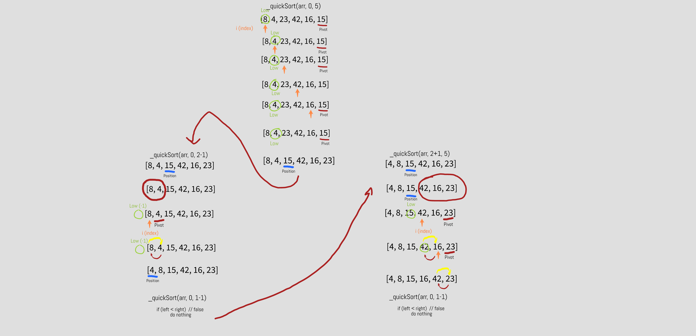

# Quick Sort

**Author:** Ayrat Gimranov

## Description

Quick Sort 

## Algorithm Code

Here is the pseudocode of the algorithm:

```javascript
 ALGORITHM QuickSort(arr, left, right)
    if left < right
        // Partition the array by setting the position of the pivot value
        DEFINE position <-- Partition(arr, left, right)
        // Sort the left
        QuickSort(arr, left, position - 1)
        // Sort the right
        QuickSort(arr, position + 1, right)

ALGORITHM Partition(arr, left, right)
    // set a pivot value as a point of reference
    DEFINE pivot <-- arr[right]
    // create a variable to track the largest index of numbers lower than the defined pivot
    DEFINE low <-- left - 1
    for i <- left to right do
        if arr[i] <= pivot
            low++
            Swap(arr, i, low)

     // place the value of the pivot location in the middle.
     // all numbers smaller than the pivot are on the left, larger on the right.
     Swap(arr, right, low + 1)
    // return the pivot index point
     return low + 1

ALGORITHM Swap(arr, i, low)
    DEFINE temp;
    temp <-- arr[i]
    arr[i] <-- arr[low]
    arr[low] <-- temp

```

*(Source: CodeFellows 401 JavaScript curriculum, Code Challenge 28 - Quick Sort algorithm)*

---
And here is my implementation of it in JavaScript:

```javascript
function quickSort(arr) {

  if (arr.length < 2) return arr
  let left = 0
  let right = arr.length - 1

  _quickSort(arr, left, right);

  function _quickSort(arr, left, right) {

    if (left < right) {
      let position = partition(arr, left, right)
      _quickSort(arr, left, position - 1)
      _quickSort(arr, position + 1, right)
    }
  }

  function partition(arr, left, right) {
    let pivot = arr[right]
    let low = left - 1

    for (let i = left; i < right; i++) {
      if (arr[i] <= pivot) {
        low++
        swap(arr, i, low)
      }
    }

    swap(arr, right, low + 1)  
    return low + 1
  }

  function swap(arr, i, low) {
    let temp
    temp = arr[i]
    arr[i] = arr[low]
    arr[low] = temp
  }

  return arr
}
```

---

## Step-by-step Visual

Sample input array: ```[8, 4, 23, 42, 16, 15]```

Expected output sorted array: ```[4, 8, 15, 16, 23, 42]``` 




## Big O

- Time complexity - O(n^2)


- Space complexity - O(1)

