# Insertion Sort algorithm step-by-step

**Author:** Ayrat Gimranov

## Explanation

Insertion Sort is an iterative sorting algorithm that works by sub-dividing values into two sides:
    1 - sorted part of the array (left side)
    2 - unsorted part of the array (right side)

The sorted side will start with one element and will grow as we take elements from the unsorted side and place them to where they belong in the sorted side, step-by-step.

## Real world comparison

In real world ***insertion sort*** is similar to the process of sorting a hand of playing cards, as we pick them up from a deck one-by-one.

The first card is the only one in our hand so far. So, the sorting starts with the second card. We pick up the second card and compare it against the first: if its of a lesser value, it goes the left. Otherwise, it goes to the right of the first card.

Next, we pick up a third card. To find its rightful place within our hand currently consisting of the first two cards, we will compare it against the cards in our hand in the direction from right to left. (Remember, the two cards in our hand are already sorted. So, the card to the right side of our hand has the greatest value). The process repeats itself until we ran out of new cards in the deck. If the value of a new card is less than the first card from the right of our hand, we will keep going and compare it to the next card, until we find the card with a lesser value than our new card. In the process of comparison, once we find the card with a lesser value in our hand, we can stop the comparison process further (because we know that all the other cards to the left are even lesser in value), and place our new card in front it.

## Algorithm Code

Here is the pseudocode of the algorithm:

```
  InsertionSort(int[] arr)

    FOR i = 1 to arr.length

      int j <-- i - 1
      int temp <-- arr[i]

      WHILE j >= 0 AND temp < arr[j]
        arr[j + 1] <-- arr[j]
        j <-- j - 1

      arr[j + 1] <-- temp
```

*(Source: CodeFellows 401 JavaScript curriculum, Code Challenge 26 - INsertion Sort algorithm)*

---
And here is the same pseudocode implemented in JavaScript:

```javascript
function insertionSort(arr) {

  for (let i = 1; i < arr.length; i++) {

    let j = i - 1;
    let temp = arr[i];

    while (j >= 0 && temp < arr[j]) {
      arr[j + 1] = arr[j];
      j = j - 1;
    }

    arr[j + 1] = temp;
  }
}

```
---

## Step-by-step Visual

Sample input array: ```[8, 4, 23, 42, 16, 15]```

Expected output sorted array: ```[4, 8, 15, 16, 23, 42]``` 

#### Loop 1 (i = 1) in `for` loop. (Element we are working on is `4`)

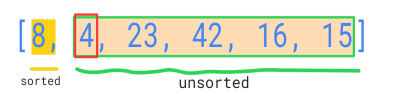
Our sorted sub-array has only one element, which is 8.
Unsorted subarray has `4, 23, 42, 16, 15`.

We start off by assigning `j` index to the first element from the right side of our sorted sub-array. (it will further decrement within the `while` loop, representing movement from right to left as we are comparing our current element against the elements in the sorted array).

We remember current element we are working on, which is `4` by assigining it to `temp`.

Next, our `WHILE` loop has two conditions, both of which has to be met in order for it to fire off.

Condition 1 will be met as long as we haven't gone through checking against all of the elements in the left subarray.

Condition 2 is checking whether our current element is less than the element in the subarray we are comparing it against.

Now, we enter the `while` loop, because there is `8` in our subarray we have to check the `4` against AND `4` is less than `8`.

Within `while` loop, we copy the element at `j` (i.e.`8`), and paste it on top of the `4`.

Then we decrement our index `j` by one. And now it becomes `-1` (meaning we ran out of elements in sorted subarray).

When we went through our first `WHILE` loop, this is is how our array looks like.

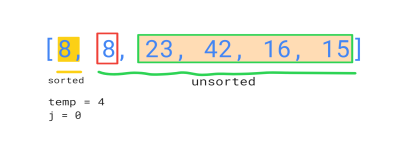

We attempt to run the `while` loop again, but the first condtition is not met (we reached the end of the left sub-array going from right to left), and so we break out of it.

Moving forward within our first `for` loop, we have to replace our current element (`4`), with the `8`. (essentially we switched `8` and `4`)

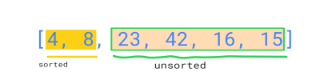

And this is the resulting array after we completed our first `for` loop.

#### Loop 2 (i = 2) in `for` loop. (Element we are working on is `23`)

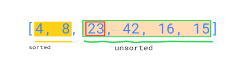

- j index is again assigned to the first element in the sorted array from the right, which is also the greatest in value.
j = i - 1 = 1 (i.e `8`)

- remember the current element
temp = 23

- checking conditions of while loop:
  - condition 1 is met (`j` is >= 0)
  - condition 2 is Not met (`23` is NOT less than `8`)

Not entering the `while` loop. Our element is bigger than `8` and for a matter of fact, it's bigger than any other element to the left of `8`, since that sub-array is sorted. So, we don't even have to compare it against the rest of the sorted sub-array.

- In last code line of the `for` loop, we will place our current element, on top of whatever element is to the right of `8`. In this case, it happens to be itself, i.e `23`, because we haven't done any shifting within the sorted sub-array.

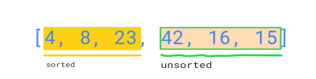

#### Loop 3 (i = 3) in `for` loop. (Element we are working on is `42`)

This loop is identical to the previous loop. `42` is going to get copy and pasted over itself, without triggering the nested `while` loop and, thus, leaving the order of the left subarray as it is.

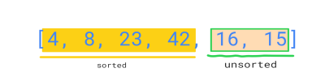

#### Loop 4 (i = 4) in `for` loop. (Element we are working on is `16`)

- set `j` index to the first element of sorted subarray from the right (`j` = 4-1 = 3, i.e. `42`)
- remember `16` by assigning it to `temp`
- check for `while` loop conditions
  -  j is >= 0 (met)
  -  `temp` is < `42` (met)

  Both conditions are met.
  - `while` loop 1:
    - `42` gets copied over on top of `16`;
    - `j` decrements by one to the left (j is now = 2. So, at the start of our next `while` loop we will compare our element `16` against `23` )
    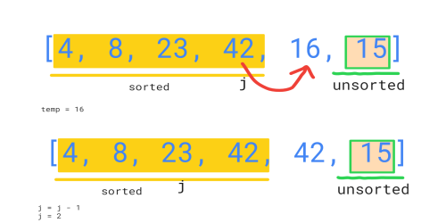

- checking conditions of `while` again
  - `j` is 2 now, which is still >= 0 (met)
  - `temp` is still `16`, and now we are checking it against the next element of the sorted sub-array, left to right. Since we decremented `j` by one at the end of our previous `while` loop, it points to `23` now. And `16` is also < `23` (met)

  Both conditions are met.
  - `23` gets copied over the element to the right of itself
  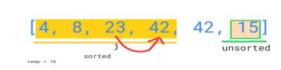
  - `j` gets decermented by one, and will point to `8`
  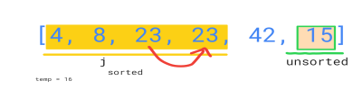

- checking conditions of `while` loop again
  - `j` is 1 now, still >= 0 (met)
  - `temp` is still `16`, checking it against element at `j` index, which is `8`. This time, `16` is NOT less than `8`. Condition is not met, we break out of a `while` loop.

  We compared our element `16` against the elements in the sorted sub-array right to left until we found the one that is less than `16`. No point of comparing it further down the sorted sub-array, as we know that everything else is going to be even smaller in value.

- as the last step to finish our current `for` loop iteration, we now have to place the remembered `temp` element, which is `16`, to the right of the element at `j`, which is `8`. And we will override the element `23` that is currently at that position, because `23` already got moved up earlier by copying.

---

So far we have: 

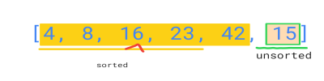

#### Loop 5 (i = 5) in `for` loop. (Element we are working on is `15`)

The process is similar the the previous `for` loop iteration.


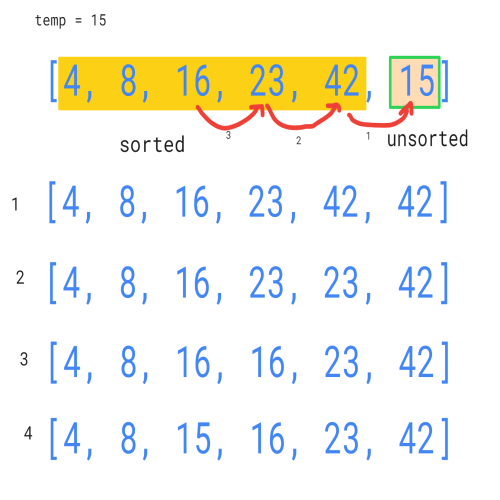

#### Result

We break out of `for` loop since `i` reached the length of the array.

## Big O

At its worst, insertion sort runs runs at O(n^2) time complexity, due to having nested loops.

Big O for space complexity is O(1)

