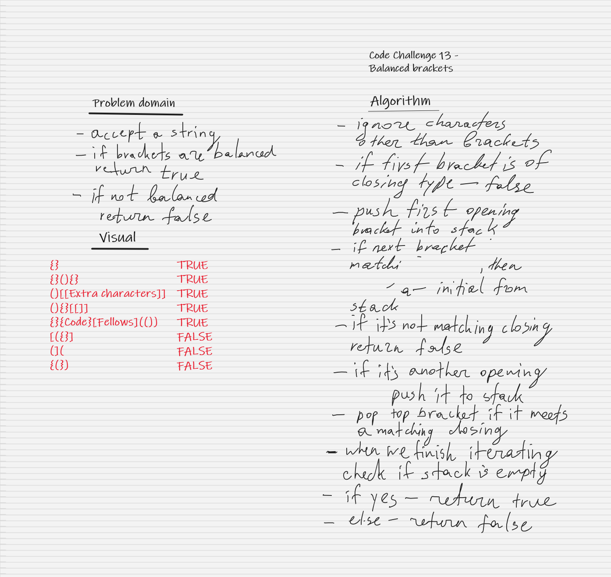

# 401-JS: Code Challenge 10 - Stack and Queue

## Challenge

Write a function called "validateBrackets"

- Arguments: string
- Return: boolean representing whether or not the brackets in the string are balanced

There are 3 types of brackets:

- Round Brackets : ()
- Square Brackets : []
- Curly Brackets : {}
  
## Approach & Efficiency
<!-- What approach did you take? Why? What is the Big O space/time for this approach? -->
Function has Big O(n) for time, as it iterates once throughout each element of the array at a worst case scenario.

## API
<!-- Description of each method publicly available to your Linked List -->
### Stack

- push(value)
  - adds a new node with that value to the top of the stack with an O(1) Time performance.
- pop()
  - Returns: the value from node from the top of the stack
  - Removes the node from the top of the stack
- peek()
  - Returns: Value of the node located at the top of the stack
- isEmpty()
  - Returns: Boolean indicating whether or not the stack is empty.
  
## Whiteboard

