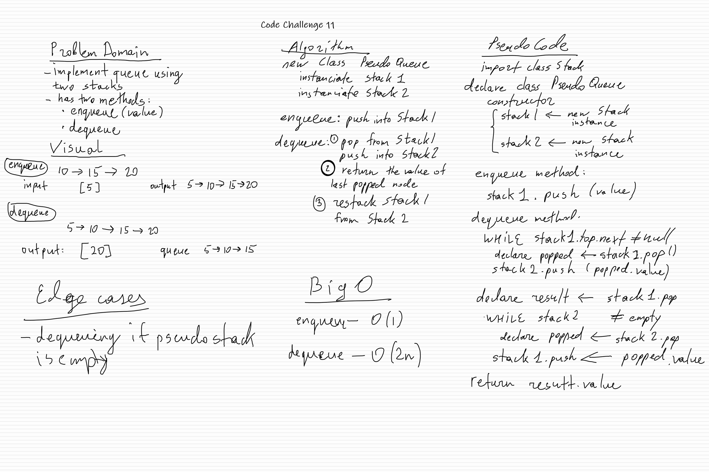

# 401-JS: Code Challenge 11 - Implement queue using two stacks

## Challenge

Create a new class called pseudo queue.

Do not use an existing Queue.

Instead, this PseudoQueue class will implement our standard queue interface (the two methods listed below),

Internally, utilize 2 Stack instances to create and manage the queue. (Stack instances have only push, pop, and peek methods. Instantiate these Stack objects in your PseudoQueue constructor.)
  
## Approach & Efficiency
<!-- What approach did you take? Why? What is the Big O space/time for this approach? -->
Enqueue method: Big O(1);

Dequeque method: Because we have to use two instances of a stack, and pop and push nodes between them, Big O time directly depends on how many items are already in the pseudo-stack. A pop/push operation have to be performed twice on each item in the pseudo queue. So, Big O for time is O(2n).

## API
<!-- Description of each method publicly available to your Linked List -->
- enqueue(value)
  - Arguments: value
  - Inserts value into the PseudoQueue, using a first-in, first-out approach
- dequeue()
  - Arguments: none
  - Extracts a value from the PseudoQueue, using a first-in, first-out approach

## Whiteboard

