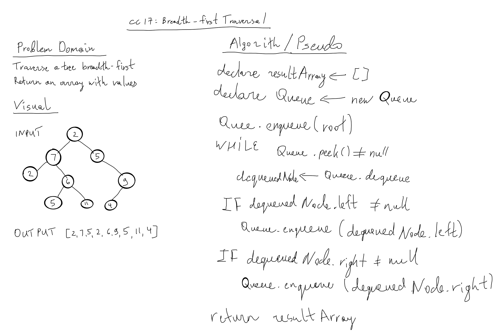

# 401-JS: Code Challenge 17 - Trees: Breadth-first Traversal.

## Challenge

- Write a function called breadth first
  - Arguments: tree
  - Return: list of all values in the tree, in the order they were encountered
- NOTE: Traverse the input tree using a Breadth-first approach

### Input

### Output

>[2,7,5,2,6,9,5,11,4]

## Whiteboard

## Approach & Efficiency
<!-- What approach did you take? Why? What is the Big O space/time for this approach? -->

Using a WHILE loop we are traversing the entire tree and at the same time using a queue.

Big O time - O(n);

## Resources

[CodeFellows learing: trees](https://codefellows.github.io/common_curriculum/data_structures_and_algorithms/Code_401/class-15/resources/Trees.html)
