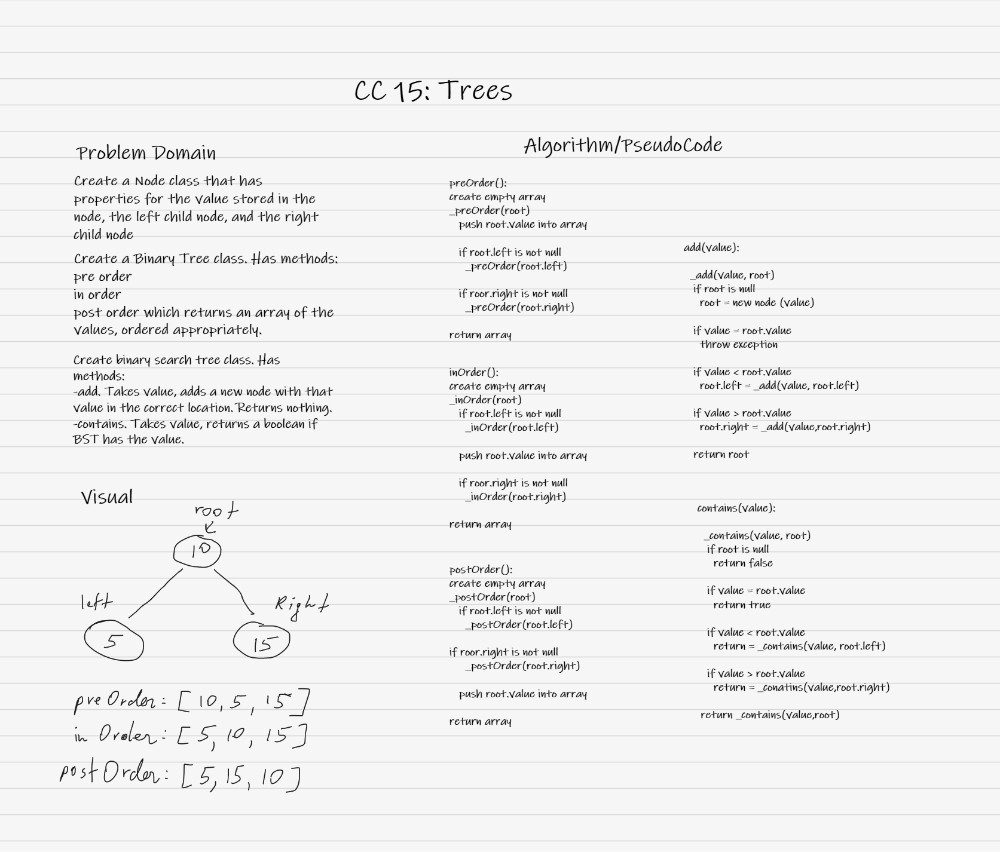

# Trees

## Challenge

### Binary Tree

Create a Binary Tree class.

Define a method for each of the depth first traversals:

- pre order
- in order
- post order which returns an array of the values, ordered appropriately.

### Binary Search Tree

Create a Binary Search Tree class.

This class should be a sub-class (or your languages equivalent) of the Binary Tree Class, with the following additional methods:

- Add
  - Arguments: value
  - Return: nothing
  - Adds a new node with that value in the correct location in the binary search tree.
- Contains
  - Argument: value
  - Returns: boolean indicating whether or not the value is in the tree at least once.

## Approach & Efficiency
<!-- What approach did you take? Why? What is the Big O space/time for this approach? -->
Big O time for `preOrder`, `inOrder`, `postOrder`  is O(n);

Big O time for `add` and `contains` is O(log n);

## API
<!-- Description of each method publicly available to your Trees -->
- Binary Tree
  - preOrder => root -> left -> right
  - inOrder => left -> root -> right
  - postOrder => left -> right -> root
- Binary Search Tree
  - add - If added value is smaller than root, adds to left child node, otherwise adds to right child node.
  - contains - If binary search tree contains an integer, returns `true`. Otherwies, returns `false`. 

## Whiteboard

